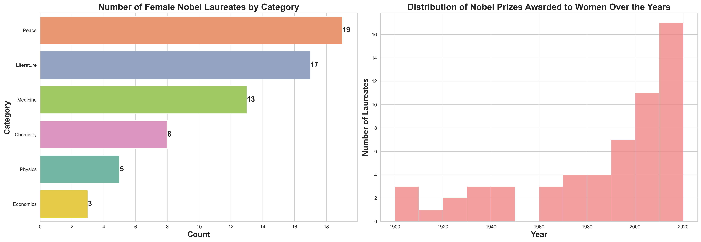

# Nobel Prize Data Analysis Project


## 🚀 About This Project
This project explores the Nobel Prize dataset (1901–2023) using Python and Jupyter Notebook. It demonstrates data analysis, visualization, and storytelling skills by uncovering trends in gender, birth country, female laureates, and repeat winners.

## 💡 Why I Did This
I wanted to practice real-world data analysis and visualization, and to answer interesting questions about Nobel Prize history. This project helped me strengthen my skills in pandas, seaborn, matplotlib, and communicating insights.

## 🛠️ Skills & Tools
- Python (pandas, numpy)
- Data visualization (seaborn, matplotlib)
- Data cleaning & transformation
- Jupyter Notebook
- Exploratory Data Analysis (EDA)

## 📊 Key Results & Visualizations
- Most commonly awarded gender and birth country
- US-born laureates by decade
- Female laureates by category and year
- First female Nobel laureate
- Repeat Nobel Prize winners




## 📝 What I Learned
- How to clean and explore a real dataset
- How to create clear, annotated visualizations
- How to communicate findings in a notebook and README

## 📂 Project Structure
```
Nobel_Prize.png
notebook.ipynb
README.md
/data/
    nobel.csv
```

## 🔗 Portfolio & Contact
- [My LinkedIn](https://www.linkedin.com/in/alaeddin-bahrouni/)
- Email: alaeddin.bahrouni@gmail.com

## 🏷️ License
MIT License

---
*Thank you for viewing my project! Feel free to reach out or connect.*
